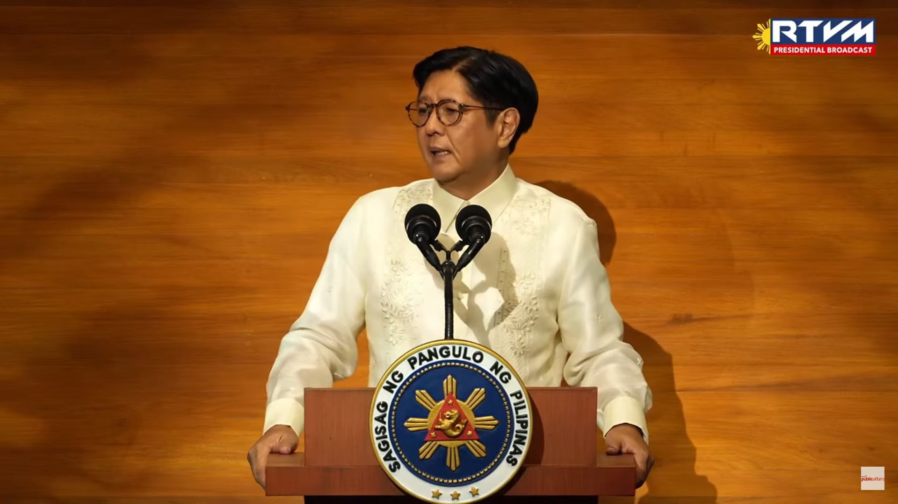

# **Take on SONA July 2025 of Pres. Ferdinand R. Marcos Jr.**
*by Espiritu, Antoinette from 9-Potassium*

## 1. *Give 2-4 key points from the SONA 2025 that you found interesting*

* Information of the for future infrastructure they have planned
* Making necesities ( healthcare/wifi and internet) accesible to more people.
* Actions against criminals regardless of status.

## 2. *Give 1-3 key points from SONA 2025 that you found weird for any reason*

* Dancing around the responsibility the government had when the recent typhoons hit.

## 3. *Write 2 paragraphs of refletion*

- My personal reflection on the 2025 SONA is very neutral, although I am glad the president is trying to uplift the peoples spirits in these times. He spoke many times of the infrastructure plans he had, and making sure that things like healthcare and the internet are far more available. He clearly knows that people voted for him because they wanted progress in our country, and to match the greatness we had during his fathers time. I see the progress, especially in the many roads that make places more interconnected but at the cost of many peoples communities and homes. 

- My second personal take away is how he put more responsibility about keeping safe in this harsh on the people and not on the government but still having the ability to respect those who passed away. It opens up the debate again about who is more responsible for things like pollution and change here in our country. I would argue both have their part to play given our population size, but lots of the power is still in the hands of the government. It was even clearer to me that he tried to avoid talking about it despite his many plans for infrastructure but I still hope there are more plans to help prevent flooding and to keep our country clean.

## *4. What 1 word/phrase/or sentence do you have for the Philippines after hearing SONA 2025?*

In these times of harsh weather and uncertain political climate, may we as Filipino's always remain resilient, yet not afraid to ask for help. 
